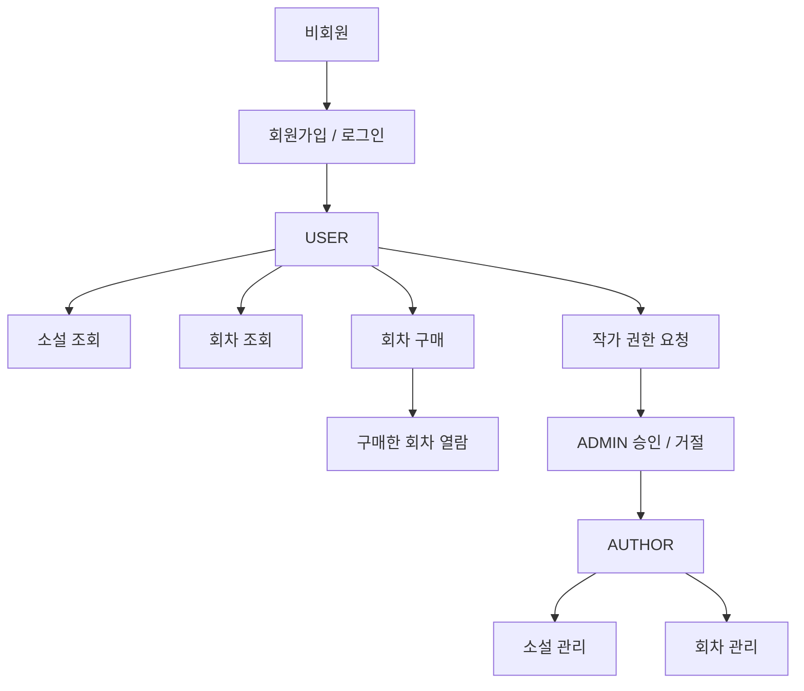

# 📌 Novelia

노벨리아는 제로베이스 백엔드스쿨 부트캠프 수료 시, 최종 과제로 제출한 **웹소설 플랫폼 백엔드 개인 프로젝트**입니다.  
JWT 기반 인증과 역할 기반 인가를 적용하여 일반 사용자(`USER`), 작가(`AUTHOR`), 관리자(`ADMIN`) 권한을 분리하고,  
작가 권한 요청/승인, 소설·회차 관리, 회차 구매 및 열람 제한 기능을 **REST API**로 구현했습니다.

---

## 🧭 프로젝트 소개

노벨리아는 아래와 같은 흐름을 중심으로 설계했습니다.

- JWT 기반 로그인 인증
- 역할별 API 접근 제어
- 일반 사용자 → 작가 권한 요청 → 관리자 승인 프로세스
- 회차 구매 후 열람 가능한 구조
- 공통 응답 형식 및 전역 예외 처리

---

## 💻 기술 스택

**Backend**  
Java 17, Spring Boot, Spring Security, JWT, Spring Data JPA

**Database**  
MySQL

**Infra / Tools**  
AWS S3, Gradle, Git / GitHub, IntelliJ IDEA, Swagger(OpenAPI)

---

## 🔄 플로우차트

JWT 인증과 역할 기반 인가를 바탕으로 사용자 권한별 주요 기능 흐름을 정리했습니다.

---

## 🧩 ERD

---

## ✨ 주요 기능

### 👤 인증 / 회원 관리
- 회원가입 및 로그인 기능 구현
- 로그인 성공 시 JWT 액세스 토큰 발급
- 아이디/비밀번호 유효성 검증 적용

### ✍️ 작가 권한 요청 관리
- 일반 사용자는 필명을 포함해 작가 권한 요청 가능
- 관리자는 요청을 승인 또는 거절 가능
- 승인 시 사용자 권한이 `AUTHOR`로 변경되고 필명이 반영됨

### 📚 소설 관리
- 전체 사용자는 소설 목록과 상세 정보를 조회 가능
- 목록 조회 시 카테고리 필터링, 검색, 페이징 지원
- 작가는 본인 소설 등록, 수정, 삭제 가능
- 관리자는 전체 소설 조회 및 삭제 가능
- 소설 삭제는 Soft Delete 방식 적용

### 📖 회차 관리
- 전체 사용자는 회차 목록 조회 가능
- 로그인한 사용자는 구매한 회차에 한해 상세 조회 가능
- 작가는 본인 소설의 회차 등록, 수정, 삭제 가능
- 회차 삭제는 Soft Delete 방식 적용

### 💳 회차 구매
- 로그인한 사용자는 회차 구매 가능
- 중복 구매 방지
- 구매하지 않은 회차는 상세 조회 제한

---

## 🔐 권한 정책

- **USER** : 로그인한 일반 사용자
- **AUTHOR** : 작가 권한 사용자
- **ADMIN** : 관리자 권한 사용자

`@PreAuthorize`를 사용해 역할별 접근 제어를 적용했습니다.

---

## 🚀 핵심 구현 포인트

### 1. JWT 기반 인증 처리
Spring Security와 JWT를 활용해 로그인 인증 흐름을 구현했습니다.  
로그인 성공 시 액세스 토큰을 발급하고, 요청마다 JWT 필터를 통해 사용자 인증을 처리했습니다.

### 2. 역할 기반 인가 설계
`USER`, `AUTHOR`, `ADMIN` 권한을 분리하고 역할별 접근 범위를 설계했습니다.  
`@PreAuthorize`를 활용해 API 레벨에서 권한 검사를 적용했습니다.

### 3. 작가 권한 요청/승인 프로세스 구현
일반 사용자가 작가 권한을 요청하고, 관리자가 이를 승인 또는 거절할 수 있도록 구현했습니다.  
승인 시 사용자 권한이 `AUTHOR`로 변경되고 필명 정보가 반영되도록 처리했습니다.

### 4. 회차 구매 및 열람 제한 구현
회차 구매 기능을 별도 도메인으로 분리해 구현했습니다.  
구매 여부를 검증하여, 구매한 사용자만 회차 상세를 조회할 수 있도록 제한했습니다.

---

## 🛠️ 트러블슈팅

### 1. multipart/form-data 요청 처리 시 DTO 바인딩 문제
`multipart/form-data` 요청 처리 중 DTO 필드가 정상적으로 바인딩되지 않는 문제가 있었습니다.  
원인은 `@ModelAttribute`가 setter 기반으로 요청 값을 주입하는데 DTO에 setter가 없어 바인딩이 실패한 것이었고, `@Setter`를 추가해 해결했습니다.

### 2. 수정 로직에서 변경 내용이 반영되지 않던 문제
엔티티를 조회한 뒤 값을 변경했지만 DB에 수정 사항이 반영되지 않는 문제가 있었습니다.  
원인을 추적한 결과 서비스 계층 수정 메서드에 `@Transactional`이 누락되어 있었고, 이로 인해 JPA의 더티체킹이 정상적으로 동작하지 않았습니다.  
수정 로직에 트랜잭션을 적용해 문제를 해결했으며, 이를 통해 **엔티티 변경이 발생하는 로직에서는 트랜잭션 경계를 함께 점검해야 한다는 기준**을 정리했습니다.

### 3. Lombok Builder 적용 시 상속 구조와 기본값 처리 문제
엔티티 생성 시 생성자 파라미터가 많아져 Builder 패턴을 적용하는 과정에서 두 가지 문제를 겪었습니다.

첫 번째는 `BaseEntity`를 상속하는 엔티티에 `@Builder`를 적용했을 때 빌더 생성 오류가 발생한 점입니다.  
원인은 `@Builder`가 상속 구조를 고려하지 않기 때문이었고, 이를 `@SuperBuilder`로 변경해 해결했습니다.

두 번째는 필드에 기본값을 지정했음에도 `@Builder`로 객체를 생성할 때 초기값이 반영되지 않는 문제였습니다.  
원인은 Lombok Builder가 필드 초기화 값을 자동으로 보장하지 않기 때문이었고, 기본값이 필요한 필드에 `@Builder.Default`를 적용해 해결했습니다.

이 경험을 통해 Builder 패턴은 단순히 생성자 가독성을 높이는 도구가 아니라, 상속 구조와 기본값 처리 여부까지 함께 고려해야 한다는 점을 배웠습니다.

### 4. Spring Data JPA 파생 쿼리 조건 순서와 인자 순서 불일치 문제
회차 상세 조회 기능 구현 중, DB에 데이터가 존재함에도 조회 결과가 반환되지 않는 문제가 있었습니다.  
원인을 확인한 결과 파생 쿼리 메서드 조건 순서와 전달 인자 순서가 일치하지 않았던 것이 문제였고, 메서드명과 파라미터 순서를 맞춰 수정해 해결했습니다.

---

## 🔍 코드리뷰를 통해 개선한 점

개인 프로젝트로 진행했지만, 멘토님과 **PR 기반 코드리뷰**를 주고받으며 구현 방향과 리팩토링 포인트를 점검했습니다.

### 주요 피드백과 반영 내용

#### 1. 인증 / 보안 흐름 정리
- JWT 필터에서 `Authorization` 헤더를 문자열로 하드코딩하지 않고, `HttpHeaders.AUTHORIZATION` 상수를 활용하도록 수정
- 회원가입과 로그인 책임을 분리하고, 토큰 발급은 로그인 시에만 수행하도록 흐름 정리

#### 2. 엔티티와 서비스 계층의 역할 정리
- 더티체킹이 필요한 경우 setter 남용 대신 엔티티의 의도를 드러내는 update 메서드를 사용하는 방향으로 정리

#### 3. API 관심사 분리
- 소설 생성/수정 API에 이미지 업로드 책임이 함께 섞여 있던 구조를 점검
- 기능별 책임이 섞이지 않도록 API 관심사를 분리하는 방향으로 개선

#### 4. 레이어 책임 분리
- 컨트롤러는 HTTP 요청/응답 처리에 집중하고, 정렬/조회 조건 조합 등은 서비스 계층으로 이동
- 이를 통해 레이어별 책임을 더 명확히 분리

#### 5. 예외 처리 기준 보완
- `IOException`을 파일 업로드 전용 예외처럼 단정하지 않고, 필요 시 도메인에 맞는 커스텀 예외로 분리하는 방향을 학습
- 전역 예외 처리와 에러 코드 관리 기준을 더 명확히 정리

#### 6. 검색/조회 구조 개선 기준 정리
- JPA 파생 쿼리의 한계를 느끼며 QueryDSL 적용 가능성을 학습

코드리뷰를 통해 동작하는 코드에 그치지 않고, 읽기 쉽고 유지보수하기 좋은 코드를 작성하는 기준을 배웠습니다.

---

## 📝 회고

이번 프로젝트에서는 기능 구현뿐 아니라 PR 단위로 변경 사항을 정리하고 코드리뷰를 반영하는 방식도 함께 익혔습니다.  
처음에는 브랜치 전략과 병합 흐름이 낯설어 어렵게 느껴졌지만, 작업 내용을 나눠 PR로 관리하고 피드백을 반영하는 과정을 반복하며 개발 과정을 더 구조적으로 정리하는 법을 배울 수 있었습니다.
