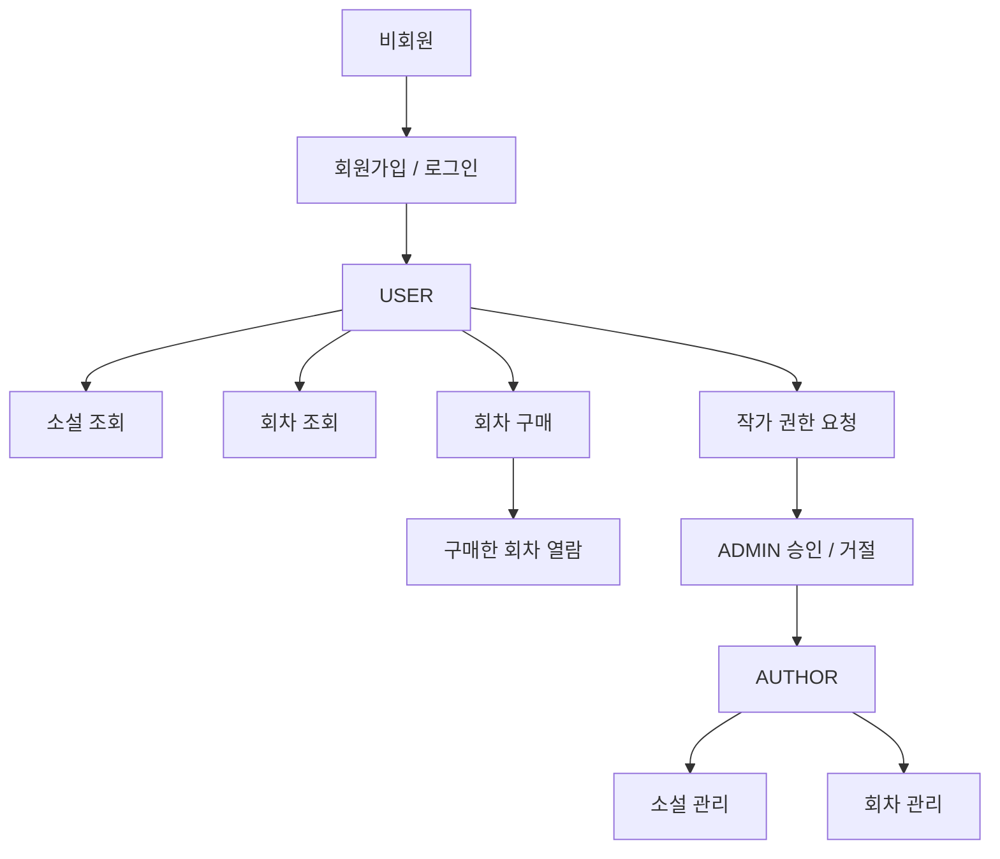
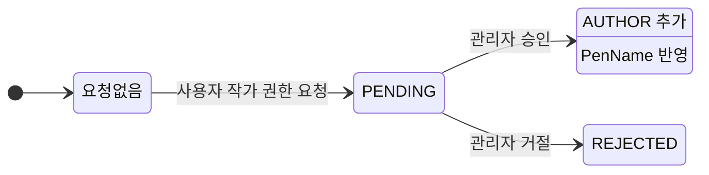

# 📌 콘텐츠 열람 관리
해당 프로젝트는 제로베이스 백엔드스쿨 부트캠프 수료 시, 최종 과제로 제출한 JWT 기반 인증과 역할 기반 접근 제어를 적용한 콘텐츠 관리 웹 애플리케이션입니다.
개인 프로젝트지만 PR 기반 코드리뷰를 받는 형식으로 진행되었습니다.

---

## 📝 프로젝트 소개

Spring Security JWT 기반 인증과 역할 별 인가를 적용 하여 사용자·작가·관리자 권한을 분리한 콘텐츠 관리 서비스입니다.
사용자는 작품 목록과 회차 정보를 조회하고, 회차를 구매한 뒤 열람할 수 있도록 구현했습니다.
작가는 자신의 작품과 회차를 등록·수정·삭제하며 콘텐츠를 관리할 수 있습니다.
관리자는 작가 권한 요청을 승인 또는 거절할 수 있도록 하여, 권한 변경과 콘텐츠 운영이 가능한 구조로 구성했습니다.

---

## 💻 기술 스택

Java 17, Spring Boot, Spring Security, JWT, Spring Data JPA, MySQL, Swagger(OpenAPI)

  
### 기술 사용 이유

| 기술 | 사용 이유 |
| --- | --- |
| Spring  Data JPA | 제한된 기간 내에 결과물을 완성해야 하는 부트캠프 과제 특성을 고려해, 직접 SQL을 세밀하게 작성하기보다 반복적인 CRUD와 객체 중심 개발에 적합한 JPA를 선택 |
| JWT | REST API의 특성상 서버가 세션을 별도로 관리하지 않고도 인증을 처리할 수 있도록 JWT를 적용 |

---

## 🔄 플로우차트

### 사용자 흐름



### 작가 권한 요청 상태 전이


---

## 🧩 ERD


---

## 🗂️ 프로젝트 구조

```
src/main/java/com/ian/novelia
├── admin
├── auth
├── author
├── episode
├── novel
├── purchase
├── rolerequest
├── global
│   ├── error
│   ├── response
│   └── security
└── s3
```

---

## ✨ 주요 기능

### 👤 인증 / 회원 관리

- 회원가입 및 로그인 기능 구현
- 로그인 성공 시 JWT 액세스 토큰 발급
- 아이디/비밀번호 유효성 검증 적용

### ✍️ 작가 권한 요청 관리

- 일반 사용자는 필명을 포함해 작가 권한 요청 가능
- 관리자는 요청을 승인 또는 거절 가능
- 승인 시 기존 USER 권한을 유지한 채 AUTHOR 권한이 추가되고 필명이 반영됨

### 📚 소설 관리

- 전체 사용자는 소설 목록과 상세 정보를 조회 가능
- 목록 조회 시 카테고리 필터링, 검색, 페이징 지원
- 작가는 본인 소설 등록, 수정, 삭제 가능
- 관리자는 전체 소설 조회 및 삭제 가능
- 소설 삭제는 Soft Delete 방식 적용

### 📖 회차 관리

- 전체 사용자는 회차 목록 조회 가능
- 로그인한 사용자는 구매한 회차에 한해 상세 조회 가능
- 작가는 본인 소설의 회차 등록, 수정, 삭제 가능
- 회차 삭제는 Soft Delete 방식 적용

### 💳 회차 구매

- 로그인한 사용자는 회차 구매 가능
- 중복 구매 방지
- 구매하지 않은 회차는 상세 조회 제한

---

## 🔐 권한 정책

- **USER** : 로그인한 일반 사용자
- **AUTHOR** : 작가 권한 사용자
- **ADMIN** : 관리자 권한 사용자

`@PreAuthorize`를 사용해 역할별 접근 제어를 적용했습니다.

---

## 🛠️ 트러블슈팅
- [작가 권한 승인 시 기존 사용자 권한이 사라지던 문제 해결](docs/troubleshooting/author-role-approval-multi-role.md)
- [Spring Data JPA 파생 쿼리 조건 순서와 인자 순서 불일치 문제](docs/troubleshooting/jpa-derived-query-parameter-order.md)

<details>
<summary>기타 트러블슈팅 보기</summary>

- [multipart/form-data 요청 처리 시 DTO 바인딩 문제](docs/troubleshooting/multipart-formdata-dto-binding.md)
- [수정 로직에서 변경 내용이 반영되지 않던 문제](docs/troubleshooting/jpa-dirty-checking-transaction.md)
- [상속 구조에서 Builder 생성 오류](docs/troubleshooting/lombok-superbuilder-inheritance.md)
- [Builder 사용 시 기본값 미반영 문제](docs/troubleshooting/lombok-builder-default-value.md)

</details>


---

## 🔍 코드리뷰를 통해 개선한 점

개인 프로젝트로 진행했지만, 멘토님과 **PR 기반 코드리뷰**를 주고받으며 구현 방향과 리팩토링 포인트를 점검했습니다.

### 주요 피드백과 반영 내용

#### 1. 인증 / 보안 흐름 정리
- JWT 필터에서 `Authorization` 헤더를 문자열로 하드코딩하지 않고, `HttpHeaders.AUTHORIZATION` 상수를 활용하도록 수정
- 회원가입과 로그인 책임을 분리하고, 토큰 발급은 로그인 시에만 수행하도록 흐름 정리

#### 2. 엔티티와 서비스 계층의 역할 정리
- 더티체킹이 필요한 경우 setter 남용 대신 엔티티의 의도를 드러내는 update 메서드를 사용하는 방향으로 정리

#### 3. API 관심사 분리
- 소설 생성/수정 API에 이미지 업로드 책임이 함께 섞여 있던 구조를 점검
- 기능별 책임이 섞이지 않도록 API 관심사를 분리하는 방향으로 개선

#### 4. 레이어 책임 분리
- 컨트롤러는 HTTP 요청/응답 처리에 집중하고, 정렬/조회 조건 조합 등은 서비스 계층으로 이동
- 이를 통해 레이어별 책임을 더 명확히 분리

#### 5. 예외 처리 기준 보완
- `IOException`을 파일 업로드 전용 예외처럼 단정하지 않고, 필요 시 도메인에 맞는 커스텀 예외로 분리하는 방향을 학습
- 전역 예외 처리와 에러 코드 관리 기준을 더 명확히 정리

#### 6. 검색/조회 구조 개선 기준 정리
- JPA 파생 쿼리의 한계를 느끼며 QueryDSL 적용 가능성을 학습

---

## 📝 회고

이번 프로젝트에서는 기능 구현뿐 아니라 PR 단위로 변경 사항을 정리하고 코드리뷰를 반영하는 방식도 함께 익혔습니다.  
처음에는 브랜치 전략과 병합 흐름이 낯설어 어렵게 느껴졌지만, 작업 내용을 나눠 PR로 관리하고 피드백을 반영하는 과정을 반복하면서 개발 과정을 조금 더 구조적으로 정리해보는 경험을 할 수 있었습니다.  
또한, 코드리뷰를 통해 단순히 동작하는 코드에서 그치지 않고, 더 읽기 쉽고 유지보수하기 좋은 방향을 고민해보는 계기가 되었습니다.
